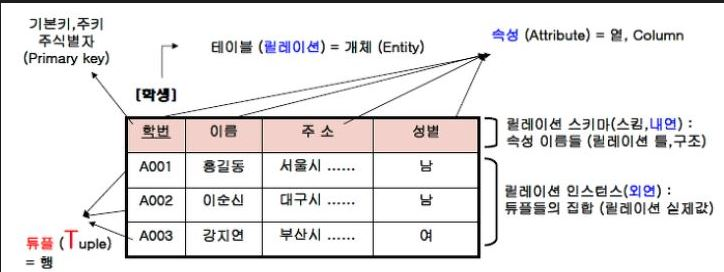

#### SQL Server  전체 운영 실습

##### 01. 요구사항  분석, 시스템 설계, 모델링

##### 정보 시스템  구축 절차 요약

1. 분석 
   - 구현하고자 하는 프로젝트의 가장 첫 번째 단계
   - 시스템, 요구사항 분석이라고도 부른다.
   - 현재 우리가 '무엇'을 할 것인지 결정하는 단계
   - 사용자의 인터뷰, 업무 조사 등을 수행하며, 많은 시간 동안 심혈을 기울여야 한다.
   - 분석의 결과로 많은 문서를 작성해야 한다.
2. 설계
   - 시스템 설계, 프로그램 설계 라고도 부른다.
   - 구축하고자 하는 시스템을 '어떻게' 할 것인지를 결정한다.
   - 설계가 끝나고 나면 결과 문서를 개발자에게 넘겨주기만 하면 설계에 나온대로 작성한다.
   - 그래서 시스템 설계가 끝나면 가장 큰 작업이 끝난 것으로 간주
3. 구형
4. 시험
5. 유지보수


##### 데이터베이스 모델링과 필수 용어

- 분석과 설계에서 가장 중요한 과정 중 하나가 **데이터베이스 모델링**
- **현실 세계에서 사용되는 데이터를 SQL Server에 어떻게 옮겨 놓을 것인지 결정하는  과정**
- 구현해야할 인터넷 쇼핑몰에서는 **사람(회원)이 필요**하다. 이 사람을 어떻게 SQL Server에 넣을 것인가? 사람의 **특성을 나타낼 수 있는 특성(속성)들을 추출**해서 그것들을 SQL Server에 넣어야 한다.
- 사람의 신분을 증명하기 위한 이름, 주민번호, 주소 / 판매할 제품들도 마찬가지로 제품의 이름, 가격, 제조일자, 제조회사, 남은 수량 등을 SQL Server에 저장해야 하는데, 이 때 **'테이블' 형식**에 맞춰 넣어야 한다.



 - 테이블 구조
    - 데이터 : 홍길동, 남 등 단편적인 정보를 뜻함. 정보는 있으나 아직 체계화 되지 못한 상태
    - 테이블 : 학생 데이터를 입력하기 위해, 표 형태로 표현한 것.
    - 데이터베이스 : 테이블이 저장되는 저장소. 주로 원통 모양으로 표현. 각 데이터베이스는 고유의 이름을 가지고 있어야 한다.
    - DBMS : DataBase Management System의 약자. 데이터베이스를 관리하는 시스템, 또는 소프트웨어를 말한다. 
    - 열(컬럼, 속성, 필드) : 각 테이블은 열로 구성된다. 
    - 열 이름 : 각 열을 구분하기 위한 이름. 열 이름은 각 테이블 내에서는 중복되지 않고, 고유해야 한다.
    - 데이터 형식 : 열의 데이터 형식을 말한다. 학생의 이름 열은 '문자'형식이어야 한다. 만약 나이 열이 있다면 해당 데이터는 숫자여야 한다.
    - 행(로우, 레코드) : 실질적인 데이터를 말한다. 학생 테이블을 예로 학생 수는 행 데이터가 몇 개 있는지와 같은 의미.
    - 기본키 : 각 행을 구분하는 유일한 열을 말한다. 중복되서는 안되며, 비어 있어도 안된다(NOT Null). 또 각 테이블에는 기본키 하나만 저장되어 있어야 한다. (기본키 열은 한 개)
    - 외래키 : 두 테이블의 관계를 맺어주는 키. 
    - SQL : DBMS에서 작업하기 위한 DBMS가 이해할 수 있는 말


----------

#### 02. SQL Server를 이용한 데이터베이스 구축 절차


1. 데이터베이스 생성
2. 테이블 생성

- 개체의 이름은 되도록 영문을 사용

3. 데이터 입력

- 입력한 행 데이터는 입력하는 즉시 저장되므로 따로 저장할 필요가 없다.

4. 데이터 활용

   - SQL은 대소문자를 구분하지 않는다.

   - 마지막 세미콜론(;)은 입력해도  되고 없어도 관계없지만, 되도록 문장의 끝에는 넣어주는 것이 좋다. (예외적으로 꼭 있어야 하는 경우가 있다.)

   - 각 문장이 끝나면  그 다음 줄에 'GO'를 써주는 것이 좋다.  

     - ```mssql
       SELECT *
       FROM memberTBL;
       GO
       ```

   - 'GO'를쓰면  이전  문장을 완전하게종료해주며, GO 이후에 나오는 문장은 완전히 새로운 시작으로 취급한다. 여러 문장을 한꺼번에  수행할 때는  GO를 꼭 써줘야 하는 경우도  있다.

   - **SQL문으로 테이블 생성**을 할 때는 테이블 이름에 띄어쓰기가  허용된다.

     - ```mssql
       CREATE TABLE "my  testTBL" (id INT);
       ```

     - CREATE 문으로 개체를 생성하게 되면 탐색기에 자동 적용되지  않기 때문에 새로고침


---

#### 03. 테이블 외의 데이터베이스 개체의 활용

####  인덱스

- '찾아보기'와 같은 개념(또는 색인)
- 책 내용 중 특정 단어를 찾을 때 첫장부터  쭉 찾아보기 보다는 '찾아보기'를 펼쳐서 해당 단어가 있는 쪽수로 이동하는 것이 훨씬 빠르다.
- 실무에서도 인덱스를 잘  활용하지 못해서 시스템의  성능이 전체적으로 느린 경우가 아주 흔하다.
- 데이터베이스 튜닝에서 가장 집중적으로 보는 부분 중 하나
- 열을 기본키로 생성하면 자동으로 인덱스가 생성된다.
- 샘플 DB에서 대량의 데이터를 복사헤어 indexTBL을 생성한다.

```mssql
SELECT
	Name,
	ProductNumber,
	ListPrice,
	Size
INTO indexTBL
FROM AdventureWorks.Production.Product;
```

- 실행 계획 시 '테이블 검색'이면 인덱스를 사용하지 않고, 테이블 전체를 검색했다는 뜻이다.

```mssql
-- 제품 이름(Name)열에 인덱스 생성
CREATE INDEX idx_indexTBL_Name
ON indexTBL(Name)
```

- 이제 인덱스 idx_indexTBL_Name은 indexTBL 테이블의 Name열에 생성된  색인이 된다.