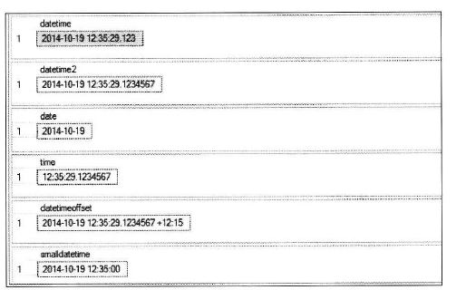

### SQL Server의 데이터 형식

#### 1. SQL Server에서 지원하는 데이터 형식의 종류

* 데이터 형식의 종류는 30가지
* 자주 사용되는 것들은 별표(★)


##### (1) 숫자 데이터 형식

| 데이터 형식      | 바이트 수 | 숫자 범위          | 설명                                                   |
| ---------------- | --------- | ------------------ | ------------------------------------------------------ |
| ★BIT             | 1         | 0 또는 1 또는 NULL | Boolean 형인 참(Ture,1) 거짓(False,0)                  |
| ★TINYINT         | 1         | 0 ~ 255            | 양의 정수                                              |
| ★SMALLINT        | 2         | -32,768 ~ 32,768   | 정수                                                   |
| ★INT             | 4         | 약 -21억 ~ +21억   | 정수                                                   |
| ★BIGINT          | 8         |                    | 정수                                                   |
| ★DECIMAL(p, [s]) | 5 ~ 17    |                    | 고정 정밀도와 배율을 가진 숫자형, 정확한 수치를 갖는다 |
| NUMERIC          | 5 ~ 17    |                    | DECIMAL과 같음, 정확한 수치를 갖는다                   |
| ★FLOAT[(p)]      | 4 ~ 8     |                    | p가 25미만이면 4바이트, 이상이면 8바이트, 근사치 저장  |
| REAL             | 4         |                    | FLOAT와 같음, 근사치 저장                              |
| MONEY            | 8         |                    | 화폐 단위로 사용, 정확한 수치를 갖는다                 |
| SMALLMONEY       | 4         |                    | 화폐 단위로 사용, 정확한 수치를 갖는다                 |

* 소수점이 들어간 실수를 저장하려면 DECIMAL을 사용하는 것이 바람직하다.


##### (2) 문자 데이터 형식

| 데이터 형식              | 바이트 수 | 설명                                                         |
| ------------------------ | --------- | ------------------------------------------------------------ |
| ★CHAR[(n)]               | 0 ~ 8000  | 고정길이 문자형, Character의 약자, **사용 후 나머지 바이트 낭비** |
| ★NCHAR[(n)]              | 0 ~ 8000  | 글자로는 0~4000자, 유니코드 고정길이 문자형. National Character 약자 |
| ★VARCHAR[{ n \| max }]   |           | 가변길이 문자형. max로 지정하면 최대 2GB 크기를 지정.        |
| ★NVARCHAR[{ n \| max }]  |           | 유니코드 가변길이 문자형. max로 지정하면 최대 2GB 크기를 지정. |
| BINARY[(n)]              |           | 고정길이의 이진 데이터 값                                    |
| ★VARVINARY[{ n \| max }] |           | 가변길이의 이진 데이터 값. max로 지정하면 최대 2GB 크기를 지정. 이미지/동영상 등을 저장하기 위해 사용됨 |

* 대용향 데이터베이스를 사용할 때 4글자 미만은 고정길이 형식이 INSERT/UPDATE할 때 더 좋은 성능을 발휘한다.
* 한글(유니코드) 저장 시 CHAR, VARCHAR의 경우 2배의 자릿수를 준비. (한글=2바이트)
  * 이 문제를 쉽게 해결하려면 NCHAR나 NCARCHAR 사용. 무조건 한 글자씩=1바이트


##### (3) 날짜와 시간 데이터 형식

| 데이터 형식    | 바이트 수 | 설명                                                         |
| -------------- | --------- | ------------------------------------------------------------ |
| DATETIME       | 8         | 1753 ~ 9999년까지. 정확도는 밀리초단위까지 인식. 시간 포함   |
| ★DATETIME2     | 6 ~ 8     | 0001 ~ 9999년까지. 정확도는 100나노초 단위까지 인식. 시간 포함 |
| ★DATE          | 3         | 0001 ~ 9999년 까지. 날짜 형식만 사용.                        |
| ★TIME          | 5         | 정확도는 100나노초 단위까지 인식. "시:분:초"                 |
| DATETIMEOFFSET | 10        | DATETIME2와 거의 비슷. 표준 시간대 인식하며 24시간제를 기준으로 하는 시간도 표시. (뒤에 표준시 붙음) |
| SMALLDATETIME  | 4         | 1900 ~ 2079년 까지. 정확도는 분 단위 까지                    |




##### (4) 기타 데이터 형식

| 데이터 형식           | 바이트 수 | 설명                                                         |
| --------------------- | --------- | ------------------------------------------------------------ |
| ROWERSION             | 8         | VARBINARY와 같다. 데이터베이스 내에서 자동으로 생성된 고유 이진 숫자를 표시한다. SQL Server 내부적으로 사용되는 것으로 신경쓸 필요 X |
| SYSNAME               | 128       | NVARCHAR와 같다. 데이터베이스 개체의 이름에 사용됨. 내부적으로 사용됨 |
| ★CURSOR               | 1         | T-SQL 커서를 변수로 처리함                                   |
| ★TABLE                | N / A     | 테이블 자체를 저장. 임시 테이블과 비슷한 기능                |
| UNIQUEIDENTIFIER      | 16        | 복제(Replication)에서 사용되는 자료형. 유일성을 보장하기 위한 GUID값을 저장함. |
| SQL_VARIANT           | N / A     | 다른 데이터 형식의 저장이 가능한 데이터 형                   |
| HIERARCHYID           | N / A     | 계층 구조가 있는 테이블을 만들거나 다른 위치에 있는 데이터의 계층 구조를 참조할 수 있음. |
| ★XML                  | N / A     | XML 데이터를 저장하기 위한 형식으로 최대 2GB 저장            |
| ★GEOMETRY / GEOGRAPHY | N / A     | 공간 데이터 형식으로 선, 점 및 다각형 같으 공간 데이터 개체를 저장하고 조작할 수 있음. |


##### (5) 사용자 정의 데이터 형식

* UDT (User-Defined Date Type, 사용자 정의 형식)은 기존의 데이터 형식에 별칭을 붙이는 것.
* 사용 편의성 때문에 주로 사용한다.
  * 이름을 저장하기 위한 데이터 형식이 NCHAR(10)이라면 편리하게 MyTypeName 등으로 붙일 수 있다.

```mssql
CREATE TYPE 사용자 정의 데이터형식_이름 FROM 기존 데이터형식 NULL 또는 NOT NULL;
```


##### (6) VARCHAR(MAX) / NVARCHAR(MAX) / VARBINARY(MAX)

* LOB(Large Object:대량의 데이터)를 저장하기 위해 지원하는 데이터 형식
* 약 2GB 크기의 파일을 하나의 데이터로 저장 할 수 있다.
* 