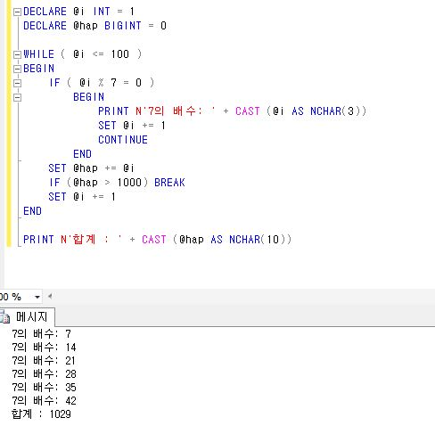
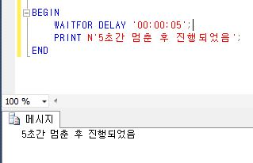

# SQL 프로그래밍


### IF ... ELSE

* 조건에 따라 분기한다.
* 이중 분기라고도 부른다.
  * 참 아니면 거짓 두가지만 있기 때문에
* 한 문장 이상이 처리되어야 할 때는 BEGIN .. END와 함께 묶어 줘야만 한다
  * 실행할 문장 단 한 문장이라도 묶어주는 것이 좋다.

```mssql
IF <부울 표현식>
	BEGIN
		SQL 문장..
	END
ELSE
	BEGIN
		SQL 문장..
	END

```

** SQL Server 2008 부터 DECLARE 구문에서 바로 값을 대입할 수 있다.

```mssql
@DECLARE @val INT = 100
```


### CASE

* 다중 분기

```mssql
CASE
	WHEN (조건) THEN 실행구문
END
```


### WHILE / BREAK / CONTINUE / RETURN

* WHILE
  * <부울 표현식>이 참인 동안에는 계속 반복되는 반복문
  * 주된 용도는 커서(Cursor)와 함께 사용된다.

```mssql
WHILE <부울 식>
BEGIN
	SQL 명령문
END
```

* CONTINUE
  * WHILE 문으로 이동해서 비교를 다시 한다.
* BREAK
  * WHILE문을 빠져 나온다.
* RETURN
  * 현재 처리되는 것을 무조건 종료하고 호출자에게 값을 반환한다.




### GOTO

* 지정한 위치로 무조건 이동하게 된다.
* 프로그램 자체의 논리 흐름을 깨는 것이므로 꼭 필요할 때 외에는 사용하지 않는 것이 바람직하다.


### WAITFOR

* 코드의 실행을 일시정지한다.
* WAITFOR DELAY
  * 지정한 시간만큼 일시정지한다.
* WAITFOR TIME
  * 지정한 시각에 실행시킨다.




### TRY/CATCH, RAISEERROR, THROW

* TRY / CATCH
  * SQL Server 2005부터 포함된 기능
  * 오류를 처리하는데 편리하고 강력한 기능을 발휘한다.

```mssql
BEGIN TRY
	원래 사용하던 SQL 문장들
END TRY
BEGIN CATCH
	만약 TRY에서 오류가 발행하면 처리할 일들
END CATCH
```

* 오류 원인 함수
  * ERROR_NuMBER() : 오류 번호
  * ERROR_MESSAGE() : 오류 메세지
  * ERROR_SEVERITY() : 오류 심각도
  * ERROR_STATE() : 오류 상태 번호
  * ERROR_LINE() : 오류를 발생시킨 행 번호
  * ERROR_PROCEDURE() : 오류가 발생한 저장 프로시저나 트리거 이름

* RAISEERROR 
  * 오류를 강제로 발생시킨다.

```mssql
RAISERROR ( { msg_id | mst_str | @local_variable}
          { , severity, state}   -- 오류 심각도 설정 0 ~ 18, 오류 발생 위치를 찾을때
          [ , argument [, ...n] ] )
          [ WITH option [, ...n ] ]
```

 **!** msg_id는 5만 ~ 21억을 사용자가 메세지 번호로 지정할 수 있는데, 그 전에 해당 번호를 sp_addmessage 저장 프로시저를 이용해 sys.message 카탈로그 뷰에 정의시켜 놓아야 한다. 또는 mst_str을 사용하면 출력할 문자열을 써주면 된다.

* THROW
  * SQL Server 2012부터 제공

```mssql
THROW [ { error_number | @local_variable },
      { message | @local_variable },
      {state | @local_variable }
      ] [;]
```

**!** error_number : 예외 번호를 지정, 5만 ~ 21억 미만의 정수. sys.message 카탈로그 뷰에 미리 등록시킬 필요 없다. **심각도(severity) 생략 - > 16으로 지정된 것.**

* RAISERROR 사용 예

```
RAISERROR(M'이건 RAISERROR 오류 발생', 16, 1);
```


### EXEC (동적 SQL)

* SQL 문장을 실행시키는 역할을 한다.
* 동적 SQL : EXEC() 함수를 이용해 쿼리문을 실행 하는 것.

```mssql
@sql = 'SELECT * FROM' + @table + 'WHERE seq = 1' 
EXEC(@sql)
```

