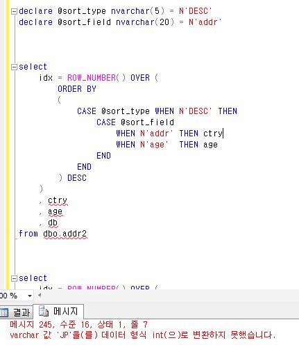
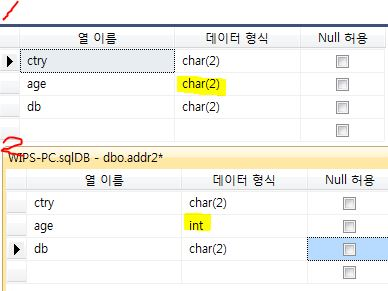
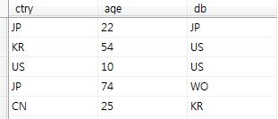
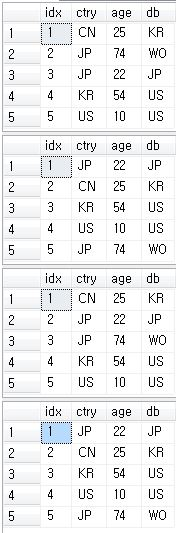

## 개선 할게 있나 살펴보기


### row_number, order by

wips패밀리 정렬 

```mssql
idx = row_number() over
			(
				order by
				(
					case @sort_type when N'ASC' then
						case @sort_field
							when N'pat_num'			then ctry
							when N'pat_dt'			then pat_dt
						end
					end
				) asc ,
				(
					case @sort_type when N'DESC' then
						case @sort_field
							when N'pat_num'			then ctry
							when N'pat_dt'			then pat_dt
						end
					end
				) desc
			   ,(
					case @sort_type when N'ASC' then
						case @sort_field
							when N'pat_num'			then pat_num
							when N'pat_dt'			then ctry
						end
					end
				) asc ,
				(
					case @sort_type when N'DESC' then
						case @sort_field
							when N'pat_num'			then pat_num
							when N'pat_dt'			then ctry
						end
					end
				) desc , doc_kind DESC		
			)
```


#### ROW_NUMBER()

```mssql
ROW_NUMBER() OVER(
	PARTITION BY A ORBER BY B DESC
)
```

PARTITION BY A

 * A컬럼을 기준으로 그룹을 나눈다.


#### 의문 

* pat_num 이 ctry와 pat_num으로 나뉜 이유는?
  * ctry order가 먼저 작성되었는데 영향이 있나?


#### 작성 순서 테스트

**!오류**



**원인 :**



​	age -> int

​	ctry -> char

두 데이터의 형식이 달라서!! 즉, case when 으로 비교할 때는 암시적 형변환이 안되서 두개의 형식이 같아야 한다.

case => then 절의 가장 높은 우선순위를 가지는 데이터 형식으로 형변환을 시도한다. 암시적 형변환이 불가능하다면 형변환 오류 .. 왜 안되는지는 모르겟음


#### 어쨋든 테스트




첫번째 : ctry asc

두번째 : db asc

세번째 : ctry asc, db asc   -> !!

네번째 : db asc, ctry asc





#### 결론

​	order by 순서 관련 있음.


#### 개선 가능?

​	then 절에 값을 2개 줄 수 있으면 되지 않을까...-> 불가능

​	**개선 필요 없음.**


### SQL 페이징

```mssql
	select
		*
	from
	(
		select -- function으로 가져오는 타이틀(ti) 정렬 때문에 서브쿼리 날림
			idx = row_number() over
			(
				order by
				(
					case @sort_type when N'ASC' then
						case @sort_field
							when N'pat_num'			then ctry
							when N'pat_dt'			then pat_dt
						end
					end
				) asc ,
				(
					case @sort_type when N'DESC' then
						case @sort_field
							when N'pat_num'			then ctry
							when N'pat_dt'			then pat_dt
						end
					end
				) desc
			   ,(
					case @sort_type when N'ASC' then
						case @sort_field
							when N'pat_num'			then pat_num
							when N'pat_dt'			then ctry
						end
					end
				) asc ,
				(
					case @sort_type when N'DESC' then
						case @sort_field
							when N'pat_num'			then pat_num
							when N'pat_dt'			then ctry
						end
					end
				) desc , doc_kind DESC		
			)
			, *
		from
		(
			select
				gzt.skey
				, bp = gzt.is_bas_pat
				, upper(gzt.db_nm) db_nm
				, gzt.ctry
				, gzt.pat_num
				, gzt.pat_dt
				, gzt.doc_kind
				, gzt.pr_cnt
				, gzt.pred_cnt
				, ti = family.fn_get_ti(gzt.skey)
				, patent.fn_get_pdf_exist(gzt.skey) AS pdf_gb
			from Fmlydb.addition.gzt as gzt
			inner join @family_skey as fmly
				on gzt.skey = fmly.skey
		) tmp
	) t
	-- 이 부분이 페이징임.
	where idx between ((@page_num - 1) * @page_row) + 1 and (@page_num * @page_row)
```


ROW_NUMBER()

​	* 출력되는 결과물에 순차적인 번호를 달아주는 기능.

​	* 화면에 출력되어야 할 순서대로 정렬을 한 뒤 가상의 번호인 row number를 앞에 달아 원하는 영역의 데이터만 가져올 수 있는 방식을 취한다.

​	* 번호를 다는 것 자체가 시스템에 부하를 줘서 많은 SELECT 결과가 있다면 속도가 느리다.

사람들은 일반적으로 3페이지 이상인 것을 거의 읽지 않는다 -> 개인 의견

즉, 페이지 번호가 낮은 곳을 더 많이 조회하고 있으므로 1000페이지를 읽는데 5초가 걸리더라도 1페이지가 0.01초 밖에 걸리지 않으면 느리지 않는다고 느낄 가능성↑


예)

```mssql
-- 총 게시글 수 25개
declare total_cnt int = 25
-- 한 페이지당 보여줄 게시글 수 10개
declare page_cnt int = 10
-- 현재 페이지
declare page int = 3

-- 현재 페이지의 시작 게시글
declare str_cnt int = (page - 1) * page_cnt + 1 --21
-- 현재 페이지의 마지막 게시글
declare end_cnt int = page * page_cnt --30


select 
	*
	, rownum as rnum -- 오라클 함수임 mssql에는 없음.
from (
	select *
    from ...
)
where rownum between 21 and 30


```


DBMS의 내부 동작 원리 상 위와 같이 페이지 내의 게시물을 가져오면 **모든 페이지 내 게시물을 가져올 대 2초가 걸리는**페이지가 될 수 있다. 어쩌면 **5초**

왜냐하면, 저렇게 범위 검색을 하게 되면 모든 테이블 내용을 정렬한 뒤 1부터 번호를 쭉 달아서 끝 번호까지 번호를 부여한 뒤에 21 ~ 30 까지의 데이터를 가져오기 때문이다.


#### 해결책

```mssql
select 
	x.rnum
	, *
from (
    -- [S]
	select
    	rownum as rnum
    	, *
    from (
        select *
        from ...
    ) 
    -- [E] 위에거랑 똑같음.
    where rownum <= 30
)
where x.rnum >= 21
```

번거롭게 한번 더 둘러싼 뒤 게시물을 가져온다.

DBMS는 ROW NuMBER를 부여하다가 위와 같이 첫번째 조건(where)를 만족하게 되면 최적화를 통해 그 아래 데이터에 대한 정보 수집을 중지한다. 그래서 30개 까지만 임시 테이블에 저장해둔 뒤 번호를 부여하고 나머지 값들은 버린다. 그 뒤에 30개 안에서 앞에 20개를 버리고 21개 째부터 나머지(=30)을 가져오기 때문에 속도가 빠르다.

-> 1000만개면 앞에거는 확실히 속도가 빠르겟지


하나의 쿼리에서 총 게시물 수를 row_number()를 통해서 페이지 쿼리와 동시에 쓰는 것도 위와 비슷한 이유로 속도가 느려진다.


즉!!!

페이징을 할 때는 전체 게시물 수 얻는 쿼리 따로, 페이지 게시물을 가져오는 쿼리를 따로 쓰고

between을 사용하지 않도록 하는 것이 중요!


**주의점 **

```mssql
select 
	x.rnum
	-- GOOD
	, to_char(create_date, 'yyyy-mm-dd') as create_date
from (
	select
    	rownum as rnum
    -- BAD
    	, to_char(create_date, 'yyyy-mm-dd') as create_date
    from (
        select *
        from ...
    ) 
    where rownum <= 30
)
where x.rnum >= 21
```

형변환을 번호를 매겨줄 때 하면 데이터의 모든 날짜 정보를 변환한 뒤 번호를 붙이기 때문에

변환 함수는 가장 마지막 단계에 해주는게 좋다.


기술문서에서 페이징에 유용하게 사용할 수 있는 기능을 찾음

```sql
OFFSET (#{PAGE} - 1) * #{FETCH} ROWS FETCH NEXT #{FETCH} ROWS ONLY
```

-> 오라클의  offset fetch 가 더 좋은 효율을 보여 줄거 같다. 구문도 간단해지고.

mssql 2012부터도 제공하는 거 같음. 

mysql에서 LIMIT가 row number 방식보다 빠른데 위에게(offset fetch) LIMIT와 같은 방식이 아닐가 싶다. -> 성능이 실말 스러움...이란 결론?


#### OFFSET

제약사항

- ORDER BY 절이 꼭 필요하다
- FETCH를 사용하려면 꼭 OFFSET이 필요


```mssql
-- 예제 1. 첫 10개의 행을 건너뛰고 나머지 행을 반환
SELECT *
FROM table
ORDER BY column 
OFFSET 10 ROWS;

-- 예제 2. 10개를 건너뛰고 10개의 행을 반환
SELECT *
FROM table
ORDER BY column
OFFSET 10 ROWS
FETCH NEXT 10 ROWS ONLY
```


