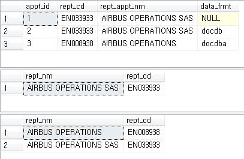
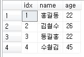
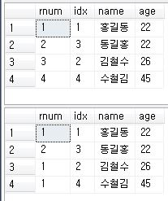
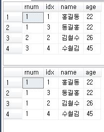
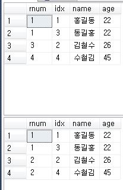

순위 함수

```mssql

-- 로직 수정 쿼리
SELECT
	rept_nm
	, rept_cd
FROM
(
	SELECT 
		DENSE_RANK() OVER(
				ORDER BY
					CASE
						WHEN data_frmt is null THEN 1
						WHEN data_frmt = N'docdba' THEN 2
						WHEN data_frmt = N'original' THEN 3
						WHEN data_frmt = N'docdb' THEN 4
						WHEN data_frmt = N'epodoc' THEN 5
						ELSE 999
					END
		) as rownum
		, rept_appt_nm AS rept_nm
		, ISNULL(un_rept_appt_cd, rept_cd) AS rept_cd
	FROM LNdb.service.rept_appt AS rept_appt
	INNER JOIN ComSearchdb.service.us_rept_appt AS us_rept_appt 
		ON rept_appt.rept_cd = us_rept_appt.us_rept_appt_cd
	LEFT OUTER JOIN ComSearchdb.service.un_rept_appt_map AS appt_map
		ON appt_map.us_rept_appt_cd = rept_appt.rept_cd
	WHERE rept_appt.skey = @skey
) as list
WHERE rownum = 1


-- 기존 쿼리
SELECT 
	rept_nm, rept_cd 
FROM(
	SELECT
		 us_rept_appt.rept_appt_nm as rept_nm
		 , case when appt_map.un_rept_appt_cd is null 
			    then
					rept_appt.rept_cd 
		        else
		            appt_map.un_rept_appt_cd
		   end rept_cd
		 , (
				ROW_NUMBER() OVER( 
									PARTITION BY us_rept_appt.rept_appt_nm ORDER BY (
																					CASE WHEN data_frmt = 'docdba' THEN 1
																						 WHEN data_frmt = 'docdb' THEN 2
																						 ELSE 3
																					END
																				)
								 )
			) check_rept_nm
	FROM LNdb.service.rept_appt as rept_appt
		INNER JOIN ComSearchdb.service.us_rept_appt AS us_rept_appt ON rept_appt.rept_cd = us_rept_appt.us_rept_appt_cd
		LEFT OUTER JOIN ComSearchdb.service.un_rept_appt_map AS appt_map ON appt_map.us_rept_appt_cd = rept_appt.rept_cd
	WHERE rept_appt.skey =@skey
	) tmp 
	where check_rept_nm = 1
ORDER BY rept_cd


```





### 0. 순위함수 구조

```mssql
<순위함수>() OVER(
	[ PARTITION BY <partition_by_list> ]
    ORDER BY <order_by_list>
)
```




### 1. ROW_NUMBER()

```mssql
-- partiton by 사용 안함
select
	rnum = row_number() over(
		order by age asc
	)
	,*
from dbo.rank 

-- prtition by 사용
select
	rnum = row_number() over(
		partition by age
		order by age asc
	)
	,*
from dbo.rank 
```




### 2. DENSE_RANK()

```mssql
select
	rnum = dense_rank() over(
		order by age asc
	)
	,*
from dbo.rank 

-- partition by 사용
select
	rnum = dense_rank() over(
		partition by age
		order by age asc
	)
	,*
from dbo.rank 
```





### 3. RANK()

```mssql
select
	rnum = rank() over(
		order by age asc
	)
	,*
from dbo.rank 

```


### 4. NTILE()

```mssql
select
	rnum = ntile(2) over(
		order by age asc
	)
	,*
from dbo.rank 
```

* 데이터를 정렬하고 나누는 것. -> 성적 순으로 반 나눌때



