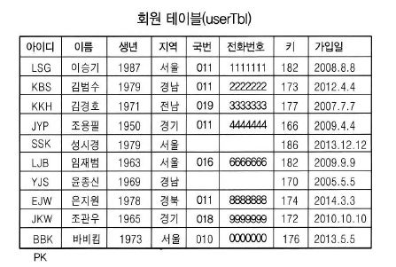
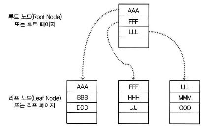
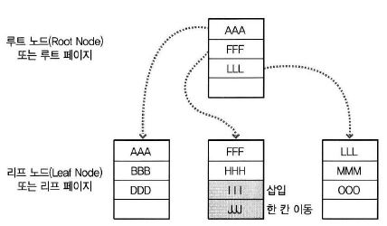
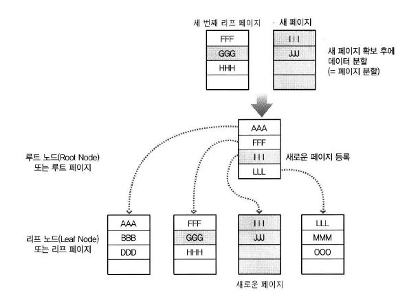
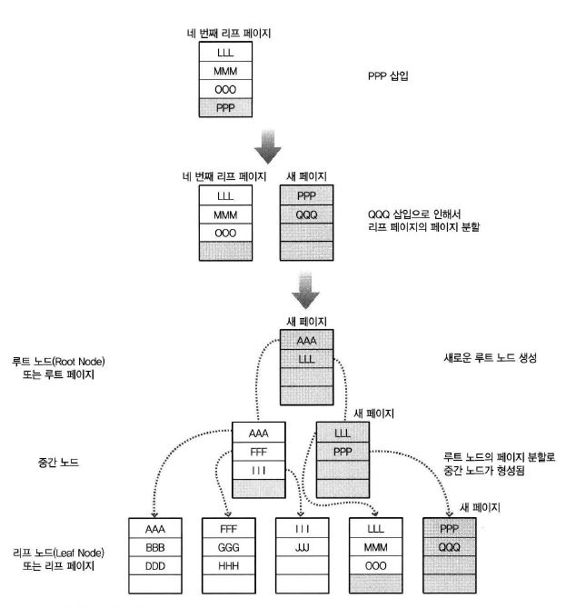
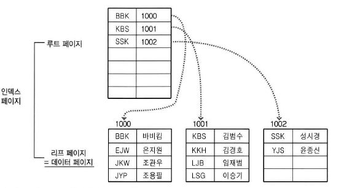
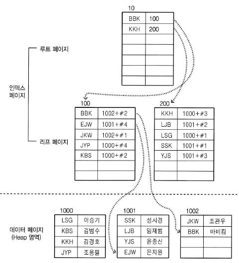
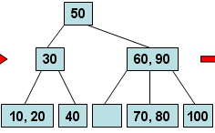

## 인덱스

* 인덱스는 데이터베이스 성능에 아주 중요한 역할을 한다.

* 가장 중요한 역할은 데이터를 조회할 때 (특히 SELECT) 빠르게 접근하게 도와주는 것이다.

* 데이터베이스를 튜닝할 때 가장 큰 효과를 볼 수 있는 부분도 이 인덱스이다.

* 하지만 인덱스를 적절히 사용하지 않는다면 오히려 시스템의 성능을 떨어뜨릴 수도 있다. 

-----------

### 개념

* 책 제일 뒷면의 ''찾아보기'' 부분과 같다.

* 데이터를 좀 더 빠르게 찾을 수 있게 해주는 도구

**!** 이 정도만을 이해하고 인덱스를 만드는 것은 위험한 일이다. **단점도 분명히 있기** 때문에 **인덱스를 효율적으로 사용하는 것은 간단한 일은 아니다.**

만약 데이터베이스 책에서 '데이터베이스' 단어가 나온 곳을 찾으려면 아마 책 모든 곳에 '데이터베이스'라는 단어가 나올 것이므로 ''찾아보기'' 페이지에는 '데이터베이스'라는 단어에 페이지 수가 수백 또는 수천개 연속해서 나올 것이다.

이 경우 ''찾아보기''가 책 내용보다 두꺼워 질 수도 있다. 게다가 ''찾아보기''를 통해 '데이터베이스'라는 단어를 찾아보려고 하니 ''찾아보기'' 한 번 -> 실제 내용 페이지 한 번 -> ''찾아보기'' 한 번 -> 실제 내용 페이지 한 번 .... 계속 페이지를 왔다갔다 할 것이다.

만들지 말았어야 할 '데이터베이스' 단어의 ''찾아보기'' 때문에 책의 두께는 쓸데없이 두꺼워져 무겁기만 하고 시간이 더 오래 걸렸다.

**!** ''찾아보기''를 사용하지 않고 책을 처음부터 끝까지 넘겨서 찾는 것을 SQL Server에서는 테이블검색이라고 한다.

즉, **필요 없는 인덱스를 만드는 바람**에 **데이터베이스가 차지하는 공간만 더 늘어나**게 되고, **인덱스를 이용해 데이터를 찾는 것**이 테이블 검색보다 **훨씬 느려지게 된다.**

**!** 실제 데이터베이스에 **인덱스를 생성해 놓으면** 인덱스를 사용하는 것이 빠를지, 그냥 전체 테이블을 검색하는 것이 빠를지는 **SQL Server가 판단**한다. 그렇더라도 쓸데없는 인덱스를 만들어서 발생되는 문제점이 많다.

#### 장점

* 검색 속도가 빨라질 수 있다 (단, 항상 그런 것은 아니다)
  * 그 결과 해당 쿼리의 부하를 줄어들어서, 결국 시스템 전체의 성능이 향상된다.

* 기존 보다 빠른 응답 속도 -> 적은 처리량으로 결과를 얻음 -> 다른 요청에 대해 많은 일을 할 수 있게됨 -> 전체 시스템의 성능이 향상

#### 단점

* 인덱스가 데이터베이스 공간을 차지해서 추가적인 공간이 필요해지는데, 대략 데이터베이스 크기의 10% 정도의 추가 공간이 필요하다.

* 처음 인덱스를 생성하는데 시간이 많이 소요될 수 있다.

* 데이터의 변경 작업(Insert, Update, Delete)이 자주 일어날 경우에는 오히려 성능이 많이 나빠질 수 있다.

---------

### 인덱스 종류와 자동생성

#### 인덱스의 종류

* 클러스터형(Clustered) 인덱스
  * 영어 사전과 같은 책
  * 책의 내용 자체가 순서대로 정렬이 되어 있어서 인덱스 자체가 책의 내용과 같은 것.
  * 테이블당 한 개만 생성할 수 있다.
  * 행 데이터를 인덱스로 지정한 열에 맟춰서 자동 정렬한다.

* 비클러스터형(Nonclustered) 인덱스
  * 책 뒤에 찾아보기가 있는 일반 책
  * 테이블당 여러 개 생성할 수 있다.

**!**

**튜닝**이란? **SQL 서버가 전보다 더욱 좋은 성능을 내게 하는 전반적인 방법**

**첫 번째 관점 : 응답 시간을 빠르게!**

A라는 **사용자가 쿼리문을 실행하면 얼마나 빨리** 결과를 얻는가가 관점이 된다. 

사용자 입장에서 아주 효과적인 것 처럼 보일 수 있지만, 잘 생각해봐야 한다. 

-> A사용자는 기존에 1분 걸리던 것은 10초 만에 얻게 되어 아주 효과적으로 보일 수 있고, 마치 튜닝이 잘 된 것처럼 보여질 수는 있지만, **서버 입장에서는 기존에 1만큼 작업하던 것을 100의 작업을 해야 하는 경우가 발생** 할 수 있다. 

즉, 한 명의 사용자에게는 결과가 빨리 나오겠지만, 전체적인 시스템의 성능은 오히려 현격히 나빠질 수 있다.

**두 번째 관점 : 서버의 부하량 최소화**

한명 한명 사용자의 응답 시간보다는 **서버가 처리하는 총 작업향을 줄임**으로써 시스템의 전반적인 성능을 향상시켜 서버가 더 많은 일을 할 수 있게 하는 것이다.

물론 사용자의 응답 속도가 빠르다는 것은 서버에서 조금만 처리하게 해서 빨라지는 경우도 많이 있지만, 그렇지 않은 경우도 종종 있으므로 주의해야 한다.

#### 자동으로 생성되는 인덱스

* 인덱스는 테이블의 열(컬럼) 단위에 생성된다.

* 하나의 열에 생성 또는 여러 열에 하나의 인덱스를 생성할 수도 있다.

열 하나당 인덱스를 생성하면 위 테이블에서 8개의 서로 다른 인덱스를 생성할 수 있다.

최초에 userTbl을 정의할 때 userID를 Primary key로 정의했으므로 자동으로 userID열에 클러스터형 인덱스가 생성된다.

**!** 클러스터형 테이블 당 한 개 생성 = 테이블당 기본키 하나

물론 테이블 최초 생성시 기본키에 'NONCLUSTERD' 옵션을 준다면 비클러스터형으로 생성되어 한 개의 클러스터 인덱스 여분이 생기게 된다.

**!** 테이블 생성 시 자동으로 생성되는 인덱스의 특징으로 제약 조건 없이 테이블을 생성할 때 인덱스를 만들 수 없으며, 인덱스가 자동 생성되기 위한 열의 제약 조건은 Primary Key 또는 Unique뿐이다.

 => 중복되지 않는 제약조건

----------

### 인덱스 내부의 작동

#### B-Tree

* Balanced Tree ( 균형 트리)

* 자료구조에 나오는 범용적으로 사용되는 데이터 구조이다.
  * 주로 인덱스를 표현할 때 사용되며, 그 외에도 많이 사용된다.

* 노드 : 트리 구조에서 데이터가 있는 공간을 말한다. 즉, 갈라지는 부분의 '마디'를 뜻한다.

* 루트 노드 : 노드의 가장 상위 노드. 모든 출발은 이 노드에서 시작된다.

* 리프 노드 : 잎 노르, 말단 노드. 제일 마지막에 있는 노드를 말한다. 

* SQL Server가 B-Tree를 사용할 때는 이 노드에 해당하는 것이 페이지(Page)이다. 페이지란 8Kbyte 크기의 가장 작은 저장 단위이다. 아무리 작은 데이터를 한 개만 저장하더라도 한 개 페이지를 차지하게 된다는 의미. 

* B-Tree 구조는 데이터를 검색할 때(=SELECT) 아주 뛰어난 성능을 발휘한다.

만약 'MMM'을 B-Tree 구조에서 찾는다면 먼저 루트 페이지를 검색하게 된다. 모든 데이터는 정렬되어 있으므로 AAA, FFF, LLL을 읽고 'MMM'은 'LLL' 다음에 나오므로 세번째 리프 페이지로 직접 이동한다. 세번째 리프 페이지에서 LLL다음 'MMM'을 찾게된다. 결국 루트 페이지에서 3개 리프 페이지에서 2개 총 5건의 데이터를 검색하여 원하는 결과를 찾았으며 총 두 페이지를 읽었다.

#### 페이지 분할

* 인덱스를 구성하게 되면 데이터의 변경 작업(UPDATE, INSERT, DELETE)을 할 때 성능이 나빠지는 단점이 있다.
  * 특히 INSERT 작업이 일어날 때 성능이 급격하게 느려질 수 있다. 그 이유는 '페이지 분할'이라는 작업이 발생되기 때문이다.
  * 이 작업이 일어나면 SQL Server가 느려지고 자주 일어나면 성능에 큰 영향을 주게 된다.

데이터가 새로 INSERT되었다고 생각해보자.

두 번째 리프 페이지에 빈 공간이 있어서 JJJ가 한 칸 아래로 이동되고 III가 그 자리에 삽입 되었다.

이 다음 'GGG'를 INSERT 한다. 더 이상 두번째 리프 페이지에는 공간이 없어서 '페이지 분할'이 일어난다. SQL Server는 우선 비어있는 페이지 한 개를 확보한 뒤, 두 번째 리프 페이지의 데이터를 공평하게 나눈다.

그 후 루트 페이지에도 새로 등록된 페이지의 제일 최상위 데이터인 III가 등록되었다.

마찬가지로 PPP, QQQ를 동시에 INSERT하는 경우에는 페이지 분할 작업 후 루트 페이지에 QQQ 리프 페이지를 등록하려고 하니, 루트 페이지도 이미 꽉 차서 페이지 분할 작업을 해야 한다. 그러면 루트 페이지가 있던 곳은 더 이상 루트 페이지가 아닌 중간 페이지가 된다. 결국 QQQ를 입력하니 3개의 새로운 페이지가 할당되고 2회의 페이지 분할 작업이 발생되었다.

#### 클러스터 / 비클러스터 인덱스 구조

* 클러스터 인덱스

  * userID로 오름차순 정렬. 데이터 페이지가 정렬되고 B-Tree 형태의 인덱스 생성
  * 데이터 검색 속도가 비클러스터보다 빠르다. 

  

* 비클러스터 인덱스

  * 데이터 페이지를 건들이지 않고, 별도의 장소에 인덱스 페이지를 생성한다.

  

  * 우선 인덱스 페이지의 리프 페이지에 인덱스로 구성한 열(userID)을 정렬 -> 데이터 위치 포인터 생성 (데이터의 위치 가르킴 / 페이지 번호 + #오프셋)  즉, 1002번 페이지의 2번째에 데이터가 있다고 기록 

### B-Tree

* 균형을 유지하는 트리
* 기존의 자식 노드를 두 개만 가질 수 있던 이진트리를 확장한 것.

* 이진트리는 추가, 검색, 삭제 등에 빠른 속도를 내지만 좌우 트리의 균형이 맞지 않을 때는 매우 비효율적인 성능을 보여준다.
* 하나의 노드에 여러 노드가 달릴 수 있다.

#### B-Tree 삽입 알고리즘

* B-Tree 규칙
  * 노드의 데이터 수가 N이면 자식 노르의 수는 항상 N+1 이어야 한다.
  * 노드 내 데이터는 반드시 정렬된 상태여야 한다.
  * 노드 데이터 X의 왼쪽 서브트리는 X보다 작은 값, 오른쪽 서브트리는 X 보다 큰 값 (=이진트리)
  * 루트 노드는 적어도 2개 이상의 자식 노드를 가져야 한다.
  * 입력 자료는 중복 될 수 없다.

* 추카하려는데 꽉 찼을 때
  * 가운데 값을 선택한다.
  * 이진트리 규칙대로 왼족, 오른쪽 서브 트리 생성 후 입력

 