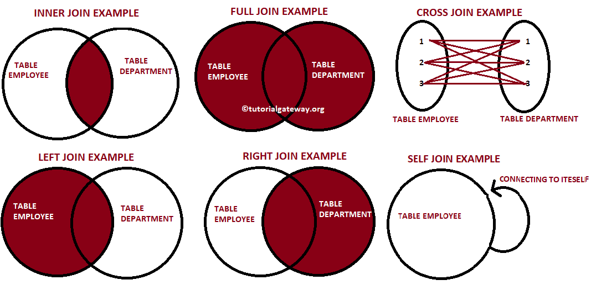
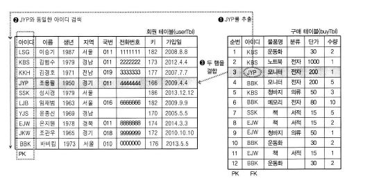
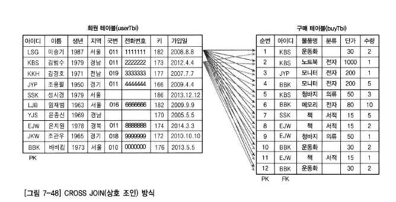
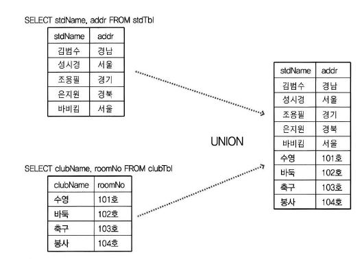

### 조인 JOIN

* 두 개 이상의 테이블을 서로 묶어서 하나의 결과 집합으로 만들어 내는 것.
* 데이터베이스의 테이블은 중복과 공간 낭비를 피하고, 데이터의 무결성을 위해서 여러 개의 테이블로 분리하여 저장한다.
  * 이 분리된 테이블들은 서로 관계(Relation)를 맺고 있다. 
  * 가장 보편적인 관계가 '1대다' 관계이다.





##### INNER JOIN

* 가장 많이 사용하는 조인
* 양 쪽 테이블에 모두 내용이 있는 것만 조인된다.
  * 예) 쇼핑몰에서 한 번이라도 구매한 기록(구매 테이블)이 있는 회원(회원 테이블)들에게 안내문 발송

```mssql
SELECT <열 목록>
FROM <첫 번째 테이블>
	INNER JOIN <두 번째 테이블>
	ON <조인될 조건>
[WHERE 검색 조건]
```

* 예

```mssql
SELECT *
FROM buyTbl
	INNER JOIN userTbl
	ON buyTbl.userid = userTbl.userid
WHERE buyTbl.userid = 'JYP';

-- 별칭을 줄 경우
SELECT b.userid, u.name
FROM buyTbl b
	INNER JOIN userTbl u
	ON b.userid = u.userid
WHERE b.userid = 'JYP'
```

* 과정
  1. 구매 테이블의 userid인 'JYP'를 추출
  2. 'JYP'와 같은 값을 회원 테이블의 userid 열에서 검색
  3. 'JYP'라는 userid를 찾게 되면 구매 테이블과 회원 테이블 두 행을 결합(JOIN)



**!** EXISTS : 조회 결과가 존재 하는지 여부 , 처리과정이 JOIN보다 복잡하여 성능이 떨어지므로 권장하지 않는다.


##### OUTER JOIN

* 양쪽 테이블에 모두 내용이 있는 것 뿐만 아니라 한쪽 테이블에만 내용이 있어도 결과가 표시된다.

```mssql
SELECT <열 목록>
FROM <첫 번째 테이블(LEFT 테이블)>
<LEFT | RIGTH | FULL> OUTER JOIN <두 번째 테이블(RIGHT 테이블)>
						ON <조인 될 조건>
[WHERE 검색 조건]; 
```

* 예 ) 전체 회원의 구매 기록을 조회, 단 구매 기록이 없는 회원도 출력 되도록 한다.

```mssql
SELECT *
FROM userTbl U
	LEFT OUTER JOIN buyTbl B
	ON U.userid = B.userid
ORDER BY U.userid;
```

* LEFT OUTER JOIN의 의미를 '왼쪽 테이블의 것은 모두 출력되어야 한다.' 정도로 해석하면 된다.
  * 줄여서 LEFT JOIN이라고만 써도 된다.
* FULL OUTER  JOIN 
  * LEFT & RIGHT
  * 양 쪽 모두에 조건이 일치하지 않는 것을 모두 출력하는 개념.
  * 활용도는 낮다.


##### CROSS JOIN(상호 조인)

* 한쪽 테이블의 모든 행들과 다른 쪽 테이블의 모든 행을 조인시키는 기능을 한다.
  * 따라서 결과 개수는 두 테이블 개수를 곱한 개수가 된다.
  * **카티션 곱**이라고도 부른다.
* 예) 회원 테이블의 첫 행이 구매 테이블의 모든 행과 조인되고, 그것을 회원 테이블의 모든 행이 반복한다.



```mssql
SELECT *
FROM buyTbl
	CROSS JOIN userTbl;
	
-- FROM 절에 이름을 나열해도 된다. 권장하지 않음.
SELECT *
FROM buyTb;, userTbl;
```

* ON 구문을 사용할 수 없다.
* 용도는 테스트로 사용할 많은 용량의 데이터를 생성할 때 주로 사용한다.


##### SELF JOIN (자체 조인)

* 별도의 구문 없이 자기 자신과 자신이 조인한다는 의미이다.
* 하나의 테이블에 같은 데이터가 있되, 의미는 다른 경우 사용한다.
  * 이부장 - 직원이름 열에도 있고, '우대리','지사원'의 상관이름 열에도 있음.
  * 우대리 직속 상관의 부서를 조회한다.

```mssql
SELECT A.emp AS 부하직원, B.emp AS 직속상관, B.department AS 직속상관부서
FROM empTbl A
	INNER JOIN empTbl B
	ON A.manaager = B.emp
WHERE A.emp = '우대리'
```


##### UNION / UNION ALL / EXCEPT / INTERSECT

* UNION

  * 두 쿼리 결과를 행으로 합치는 것.

  

  ```mssql
  SELECT 문장1
  UNION [ALL]
  SELECT 문장 2
  ```

  * 문장 1 과 문장 2의 결과 열의 개수가 같아야 하고, 데이터 형식도 각 열 단위로 같거나 서로 호환되는 형식이어야 한다.
  * 열 이름은 문장 1의 열 이름을 따른다.
  * UNION ALL을 사용하면 중복된 열까지 모두 출력되고 [ALL] 을 생략하면 중복된 열은 제거 된다.

* EXCEPT

  * 두 번째 쿼리에 해당하는 것을 제외하는 구문
  * 예 ) sqlDB의 사용자를 모두 조회하되, 전화가 없는 사람을 제외한다.

  ```mssql
  SELECT name, mobil + mobile2 AS 전화번호 
  FROM userTbl
  EXCEPT
  SELECT name, mobil + mobile2 AS 전화번호
  FROM userTbl
  WHERE mobil IS NULL;
  
  ```

* INTERSECT

  * 두 번째 쿼리에 해당하는 것만 조회한다.
  * 전화번호가 없는 사람만 조회

  ```mssql
  SELECT name, mobil + mobile2 AS 전화번호 
  FROM userTbl
  INTERSECT
  SELECT name, mobil + mobile2 AS 전화번호
  FROM userTbl
  WHERE mobil IS NULL;
  ```
