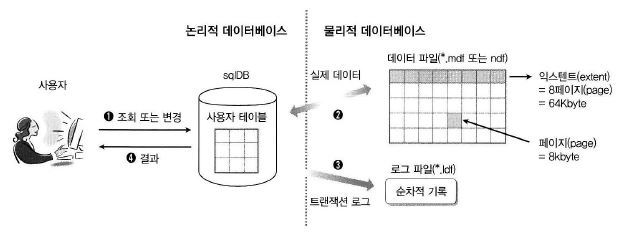
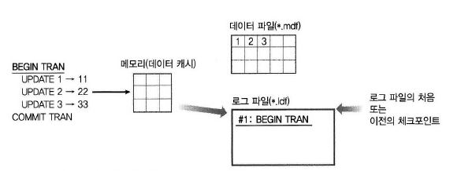
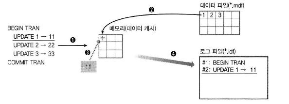
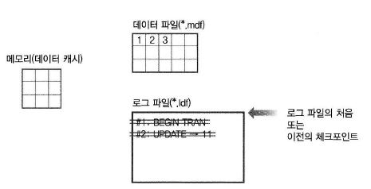
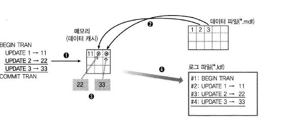
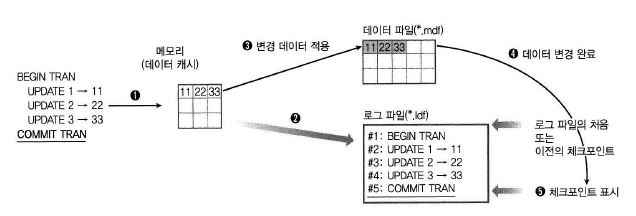
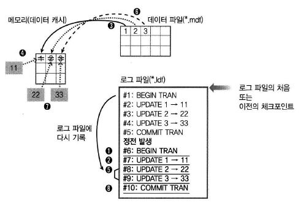
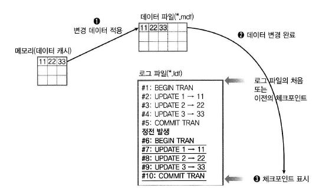

### 트랜잭션

#### 01. 데이터베이스 트랜잭션 로그 파일과 트랜잭션의 관계

##### 데이터베이스 기본 구조

```mssql
CREATE DATABASE sqlDB;
```

* 구문으로 데이터베이스 생성 시 sqlDB라는 논리적인 이름으로 **폴더에 실제 파일로 존재.**

* 생성되는 파일
  *  *.mdf : 데이터 파일. 실제 데이터(테이블,인덱스 등)와 그 행 데이터들이 저장*
  * .ldf : 트랜잭션 로그 파일. 정전등의 응급상황에도 입력된 데이터가 완전하게 해준다.
    * 완전 : 전부가 되거나, 전부가 안되거나
    * 데이터의 변경에 대해 기록해두는 공간.
  * *.ndf : 두 번째부터 추가되는 데이터파일. *.mdf 생성 이후 추가되는 데이터 파일

##### 

##### 데이터베이스 관점



* 물리적 관점
  * 실제 데이터베이스의 물리적인 형태.
  * *.mdf (또는 *.ndf)와 *.ldf 로 구성
  * 데이터들은 그냥 순차적으로 저장되는 것이 아니고 **페이지라고 불리는 최소 단위에 저장**되고
  * **하나의 테이블이나 인덱스**는 **8개의 페이지로 구성된 익스텐트에 저장**된다.
  * **실제 내용**인 행 데이터는 **각 페이지에 저장.**
    * 따라서 한 행의 크기는 한 페이지(8KB)와 같다. (varchar, nvarchar, varbinary 예외)


##### SQL 작동 방식

* 실행 과정

**SELECT addr FROM userTbl**

1. 사용자는 논리적인 데이터베이스에 **저장된 데이터를 조회**
2. 내부적으로는 **데이터 파일(*.mdf)**에 저장되어 있는 **페이지에서 데이터를 검색**해서 가져온 후
3. 사용자에게 조회한 내용의 결과를 응답한다.

**UPDATE**

1. **트랜잭션 로그파일**에 UPDATE 쿼리 **문장을 그대로 기록**
2. 데이터 파일의 페이지에 저장된 **데이터 변경**
3. 변경 결과를 응답


* 트랜잭션 로그에 기록하지 않아도 쿼리 실행 자체에는 큰 이상이 없다.

* SQL Server는 데이터 파일과 트랜잭션 로그 파일에 두 번 기록한다. -> 시스템 성능 저하

* 그럼에도 쓰는 이유
  * 데이터베이스의 무결성을 위한 것. 데이터의 완전성


##### 트랜잭션 개념

* 하나의 논리적 작업 단위로 수행되는 일련의 작업
  * = 데이터를 변경 시키는 SQL의 묶음 (UPDATE, INSERT, DELETE 등)

* 예1

UPDATE ...

UPDATE ...

UPDATE ...

   => 트랜잭션 3번 발생


* 예2
  * SQL을 트랜잭션 단위로 묶음

BEGIN [ TRANSACTION | TRAN ]

​	SQL 문장

COMMIT [ TRANSACTION | TRAN | WORK ]


* SQL Server는 **자동 커밋 모드가 디폴트.**
* 별도로 트랜잭션 단위로 **묶지 않으면** 각 쿼리 문장마다 **COMMIT이 자동으로 포함**되어 있다.
* 트랜잭션은 트랜잭션 로그 파일(*.ldf)에 저장된다. 


##### 작동 방식

```mssql
BEGIN TRAN
	UPDATE 1 -> 11
	UPDATE 2 -> 22
	UPDATE 3 -> 33
COMMIT TRAN
```


(1) BEGIN TRAN 실행



BEGIN TRAN : 트랜잭션 시작으로 인식

일련의 번호와 함께 트랜잭션 로그 파일의 처음이나 이전 체크 포인트 이후 바로 이어서 기록


* 처리 과정 완료 후 정전 -> 다시 전원이 들어온 경우
  * 컴퓨터 재부팅 -> 메모리(데이터 캐시)에 있는 내용은 모두 없어졌다.
  * 데이터 파일에는 아무런 변화를 가한 적이 없으므로 그대로 있다.
  * 트랜잭션 로그파일에 BEGIN TRAN만 적용 상태이므로 취소하면 된다. **=ROLLBACK**
    * ROLLBACK(롤백) : 트랜잭션 로그 파일 중에 아직 커밋되지 않은 내용을 트랜잭션 로그 파일의 처음(체크포인트 발생 시점)까지 취소하는 과정  


(2) UPDATE 1 -> 11 실행



2 : 데이터 파일에 실제로 있는 데이터 '1'이 데이터 캐시(Data Cache)라고 부르는 메모리로 로딩

3 : 값 변경

4 : UPDATE 1 -> 11 트랜잭션을 트랜잭션 로그 파일에 일련번호를 붙여 순차적을 기록

**아직 COMMIT TRAN 실행을 하지 않아 로그파일에 기록만 될 뿐 데이터파일(*.mdf)에는 아무런 변화가 없다.**


* 2번 완료 후 정전 -> 다시 전원이 들어올 경우

  

  *  체크 포인트까지 롤백된다.


(3) UPDATE 2 -> 22, UPDATE 3 -> 33 실행



앞의 과정과 같다.


* 3번 완료 후 정전 -> 다시 전원 들어올 경우
  * 위와 마찬가지로 롤백


(4) COMMIT TRAN 실행



2 : COMMIT TRAN + 일련번호 -> 트랜잭션 로그 파일에 기록

3 : 메모리의 변경된 데이터 (11,22,33)을 차례로 데이터 파일(*.mdf)에 적용시킨다

​	= 이를 **데이터를 커밋시킨다**라고 표현한다.

4 : 데이터 파일 변경 완료

5 : '#5' 바로 다음 체크포인트를 설정해 놓는다.


* 4번의 2 ) 로그 기록 직후 정전 -> 다시 전원

  * = 로그 기록 완료되었으나, 데이터 파일에는 적용되지 않고 정전된 경우
  * 이런 경우 롤포워드(Roll Forward)가 일어난다.
    * 롤포워드 : 트랜잭션 로그 파일의 처음이나 이전의 체크포인트 이후에 기록되어 있는 로그를 다시 수행하는 과정, 즉 예에서는 1 ~ 5까지 재수행한다.

  

  


------

### 2. 트랜잭션 상세

#### 트랜잭션의 특징

* 원자성
  * 트랜잭션은 분리할 수 없는 하나의 단위이다. 작업이 모두 수행되거나 하나도 수행되지 않아야 한다.
* 일관성
  * 트랜잭션에서 사용되는 모든 데이터는 일관되어야 한다. 이 일관성은 잠금(Locking)과 관련이 깊다.
* 격리성
  * 현재 트랜잭션이 접근하고 있는 데이터는 다른 트랜잭션에서 격리되어야 한다는 것.
  * 트랜잭션이 발생되기 이전이나 완료된 이후의 상태를 볼 수 있지만, 진행 중인 중간 데이터를 볼 수 없다. (예외는 있다.)
* 영속성
  * 트랜잭션이 정상적으로 종료된다면 그 결과는 시스템 오류가 발생하더라도 시스템에 영구적으로 적용된다.


#### 트랜잭션 문법과 종류

* 기본

```mssql
BEGIN TRAN
  SQL 문..
COMMIT TRAN
```


* 중간 위치 저장
  * 트랜잭션이 너누 길어진다면 중간 위치를 저장한다.

```mssql
SAVE TRAN 저장_이름
```


##### (1) 자동 커밋 트랜잭션

* 각 쿼리마다 자동으로 BEGIN/COMMIT TRAN이 붙여지는 것
* SQL Server 디폴트 상태이다.


##### (2) 명시적 트랜잭션

* 직접 BEGIN/COMMIT TRAN 문을 써주는 것.


##### (3) 암시적 트랜잭션

```mssql
SET IMPLICIT_TRANSACTIONS ON
```

* 오라클 등의 데이터베이스와 호환을 위해 사용
* 어떤 쿼리가 나오면 자동으로 내부적으로 BEGIN TRAN을 붙여주지만 COMMIT / ROLLBACK TRAN은 직접 써줘야 한다. (=오라클 방식)
* SQL Server에서는 별로 권장하지 않는다.

* 암시적 트랜잭션이 시작되는 쿼리
  * ALTER TABLE
  * FETCH
  * REVOKE
  * CREATE
  * GRANT
  * SELELCT
  * DELETE
  * INSERT
  * TRUNCATE TABLE
  * DROP
  * OPEN
  * UPDATE
  * 등..등
* 한 번 암시적 트랜잭션이 시작되면 COMMIT / ROLLBACK 전에는 중복으로 시작되지 않는다.


##### (4) 일괄 처리 범위의 트랜잭션

* MARS에만 해당
* MARS 섹션에서 시작되는 명시적 또는 암시적 트랜잭션